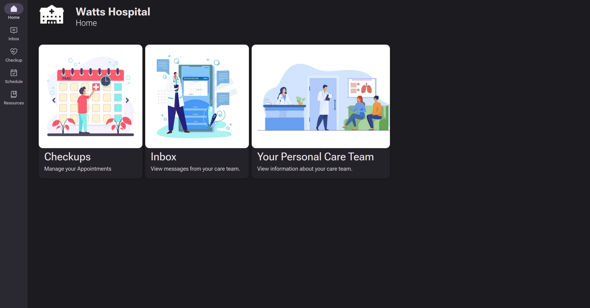
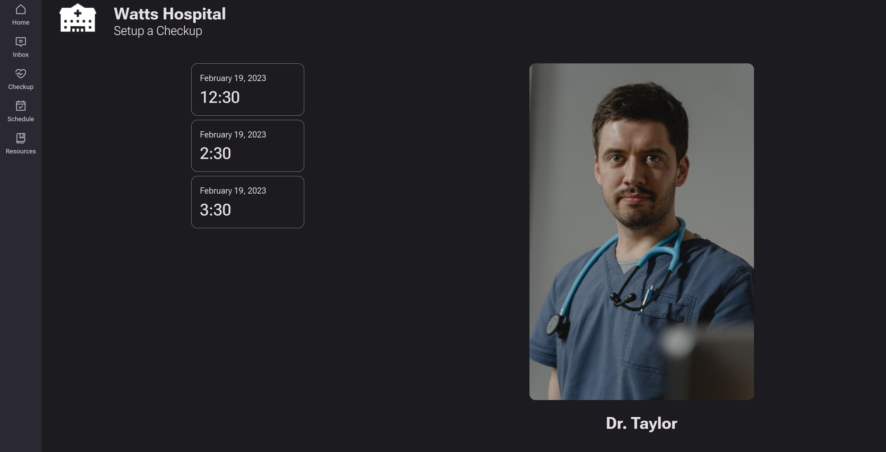
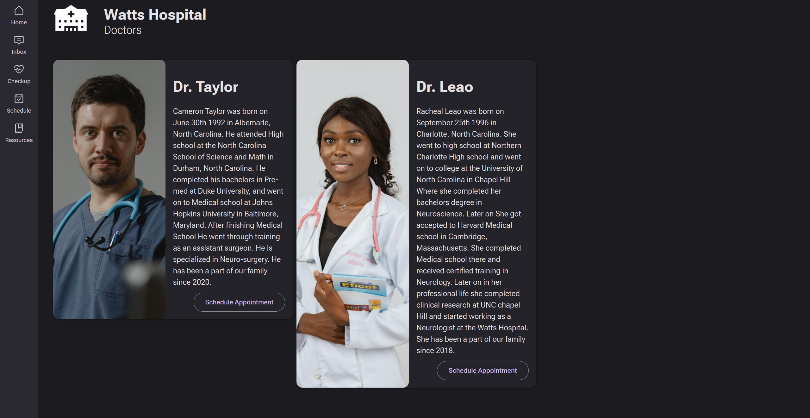
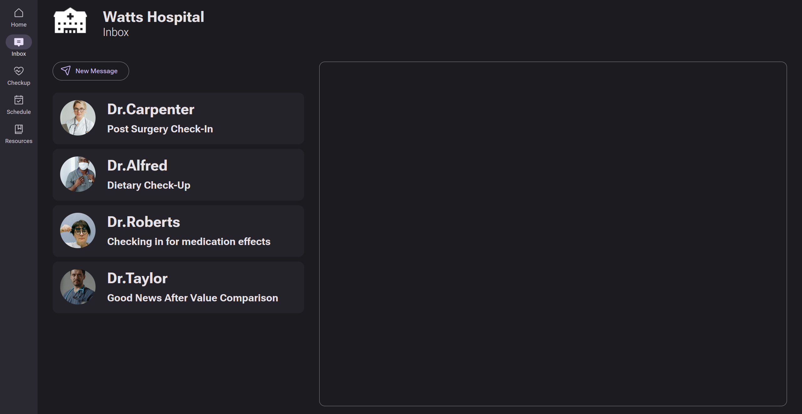
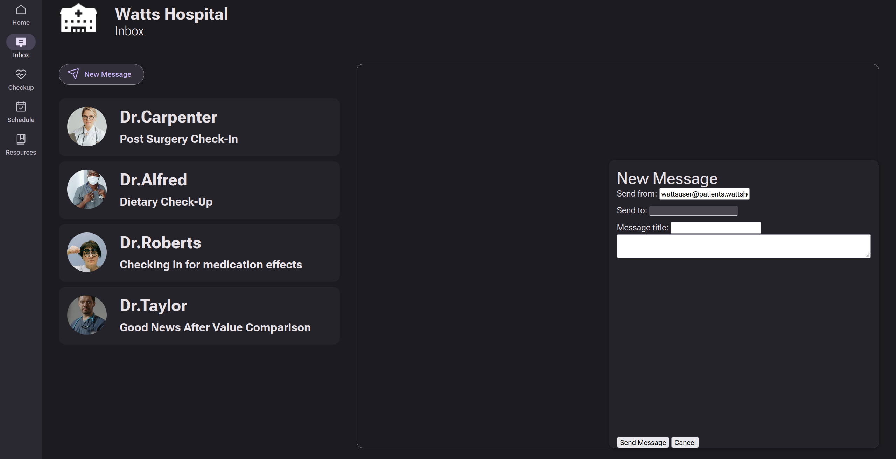
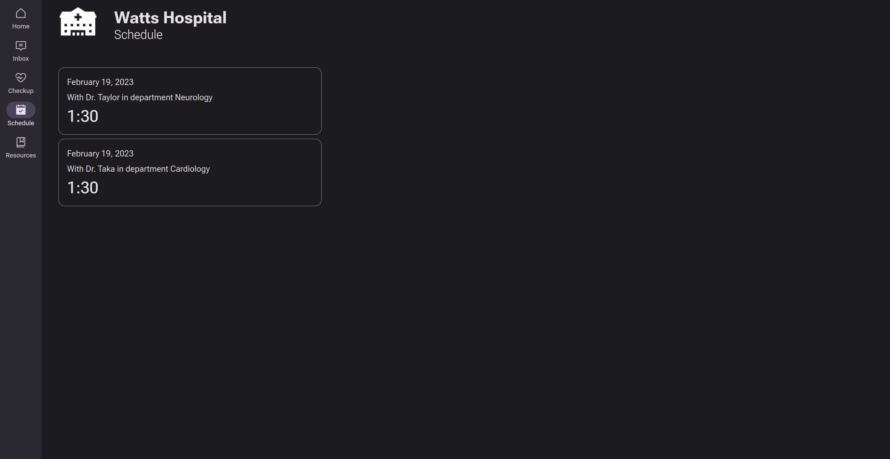

# Unihacks-2023-Healthcare-
Website for hospital functionality for Unihacks 2023 Hackathon 

# TODO
- [x] Basic UI
    - [x] Navbar
    - [x] Titlebar
    - [x] Dashboard
    - [x] Material3 theme (Yoinked from BrightShard's website)
- [ ] Email
    - [x] Store emails in database
    - [x] Send emails to doctors/Reply to emails from doctors
    - [x] Receive emails from doctors
        - [x] Mark as read after viewing
    - [ ] Improve email UI
- [ ] Schedule
    - [x] Store time/date in database
    - [x] View upcoming checkups
    - [x] Schedule future appointments
    - [ ] Change appointment times?
- [x] Care Team/Staff Info
    - [x] Bio for doctors
    - [x] Pictures for doctors
- [ ] Users
    - [x] Store users in database
    - [ ] User authentication
        - [ ] Check multiple user support afterwards
    - [ ] User/profile settings?
- [ ] Clean Code (Optional)
    - [ ] Merge Jekyll server into Rocket server
        - [ ] Rust SCSS parser
        - [ ] Rust Liquid parser, or replace Liquid with Rocket's templating system
    - [ ] Use actual database instead of Serde w/ Postcard

# Screenshots

